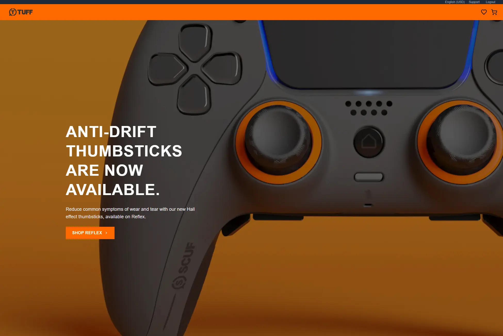
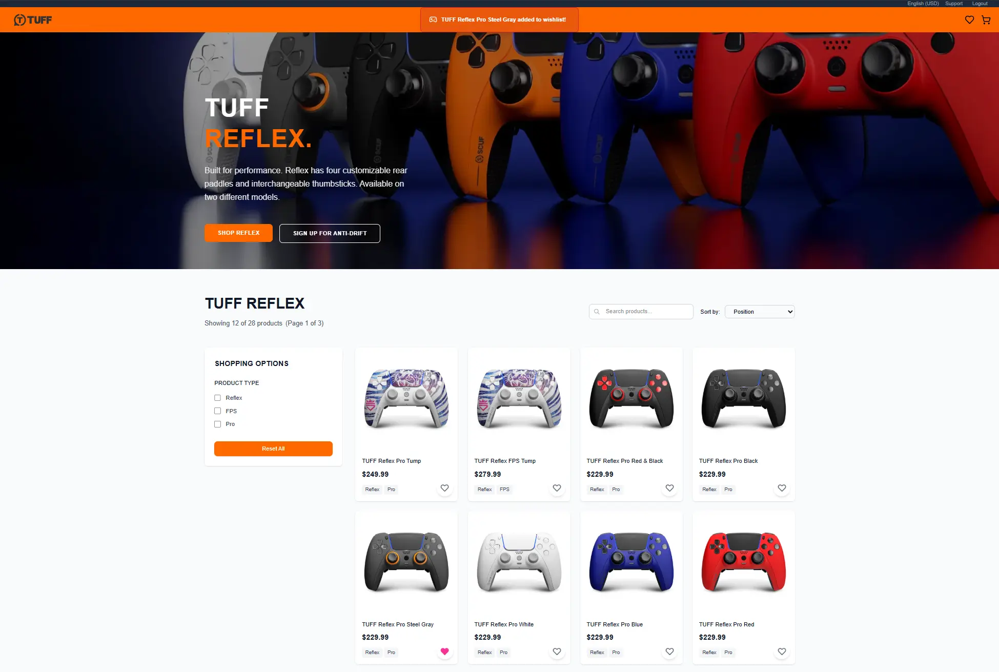
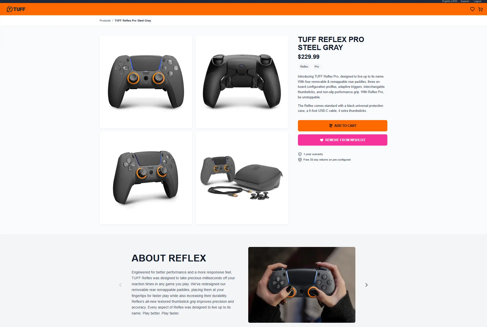

[](https://classroom.github.com/online_ide?assignment_repo_id=19935547&assignment_repo_type=AssignmentRepo)

# Tuff Gaming

An e-commerce website for a fictional gaming controller brand aimed at enthusiasts. Users can search for their favorite gamepads, add them to their wishlist, and explore products with advanced search, sorting, filtering, and infinite scroll pagination. A clone of the original Tuff Gaming website, this project showcases a modern tech stack and design principles.

This website was developed to fulfill the requirements of Graded Challenge 2 in Phase 2 of the Hacktiv8 bootcamp and demonstrates my ability to work with version control systems, implement NoSQL databases using MongoDB, utilize TypeScript for type safety, and build a scalable web application using the Next.js framework.



## Listed Pages

- **Register Page**: User registration form to create a new account.
- **Login Page**: User login form to access the application.
- **Landing/Home Page**: Displays a hero banner, basic e-commerce information, and a list of 5–10 featured products with a "See All" option.
- **Product Page**: Shows a list of all available products. Includes search functionality with debounce and infinite scroll pagination. Users can also add products to their wishlist from this page.
- **Product Detail Page**: Displays detailed information about a selected product, includes meta tag implementation for SEO, and allows users to add the product to their wishlist.
- **Wishlist Page**: Displays a list of products the user has added to their wishlist, with the ability to remove items from the list.

## Features

- **User Registration**: Allows new users to create an account with a valid email and password.
- **User Login**: Authenticates users and grants access to protected routes and features.
- **Product Listing**: Displays a list of available products with brief information.
- **Product Details**: Shows detailed information about a selected product.
- **Add to Wishlist**: Lets users save their favorite products to a personal wishlist.
- **Remove from Wishlist**: Allows users to remove products from their wishlist.
- **Search with Debounce:**: Enables users to search products by name efficiently, with a debounce mechanism to minimize API calls.
- **Infinite Scroll Pagination**: Loads more products automatically as the user scrolls down, enhancing the browsing experience.




## Tech Stack

### Frontend

- **Next.js** - React framework with App Router
- **TypScript** - Type-safe development
- **Tailwind CSS** - Utility-first CSS framework
- **Zod** - Runtime type validation

### Backend

- **Node.js** - JavaScript runtime
- **MongoDB** - NoSQL database for users, products, and wishlists data.
- **JWT** - Authentication and authorization

### Infrastructure

- **Vercel** - Frontend hosting platform with seamless deployment and global CDN

## Environment Variables

Create a `.env.local` file in the root directory with the following variables:

```bash
# Database
MONGODB_URI=your-mongodb-urii

# Authentication
JWT_SECRET=your-super-secret-jwt-key-here
```

### Required API Keys

| Service     | Required | Purpose             | Get From      |
| ----------- | -------- | ------------------- | ------------- |
| MongoDB URI | ✅       | Database connection | MongoDB Atlas |

## Project Structure

```
tuff-gaming/
├── public/                      # Static assets
├── src/
│   ├── app/                     # Next.js App Router
│   │   ├── api/                 # API routes (backend endpoints)
│   │   ├── login/               # Login page
│   │   ├── register/            # Registration page
│   │   ├── products/            # Product list and detail pages
│   │   └── wishlist/            # Wishlist-related pages
│   ├── components/              # Reusable UI components
│   ├── db/                      # Database configuration
│   ├── helpers/                 # Utility/helper functions
├── .env.example                 # Environment variables template
└── README.md                    # Project documentation

```

## API Endpoints

### Authentication

- `POST /api/auth/register` - Register new user account
- `POST /api/auth/login` - User login with email and password
- `POST /api/auth/logout` - User logout and clear authentication cookies

### Product Management

- `GET /api/products` - Get paginated products with search, filtering, and sorting
- `GET /api/products/[slug]` - Get single product details by slug
- `GET /api` - Get featured products for homepage

### Wishlist Management

- `GET /api/wishlist` - Get current user's wishlist items
- `POST /api/wishlist` - Add product to user's wishlist
- `DELETE /api/wishlist/[id]` - Remove product from user's wishlist
